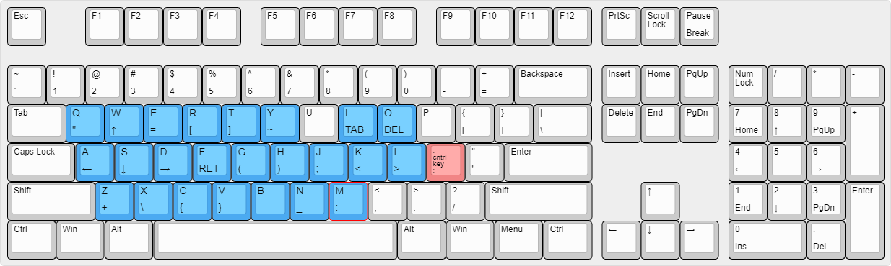

# emacs-ahk

AHK script to remap various keys. ";" is used as the control key in conjunction with other keys to produce traditionally difficult to write keys from a touch type position.

Inspired by [this emac setup](https://oremacs.com/2015/02/14/semi-xmodmap/).
The AHK code was mostly inspired by [this](https://github.com/catweazle9/emacs-everywhere) and [this](https://github.com/usi3/emacs.ahk).

## Layout

The exact remapping is seen in this image

